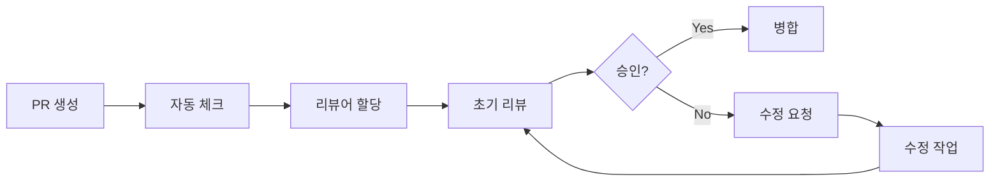

# 📝 코드 리뷰 가이드라인

효과적이고 건설적인 코드 리뷰를 위한 종합 가이드입니다.

## 📋 목차

- [🎯 코드 리뷰 목적](#-코드-리뷰-목적)
- [👥 리뷰 참여자](#-리뷰-참여자)
- [📝 PR 작성 가이드](#-pr-작성-가이드)
- [🔍 리뷰 체크리스트](#-리뷰-체크리스트)
- [💬 리뷰 코멘트 가이드](#-리뷰-코멘트-가이드)
- [⚡ 리뷰 프로세스](#-리뷰-프로세스)
- [🛠️ 도구 및 자동화](#️-도구-및-자동화)

## 🎯 코드 리뷰 목적

### ✅ 주요 목표

1. **🔒 코드 품질 보장**
   - 버그 예방 및 조기 발견
   - 성능 최적화
   - 보안 취약점 방지

2. **📚 지식 공유**
   - 팀 내 기술 전파
   - 비즈니스 로직 이해 공유
   - 베스트 프랙티스 확산

3. **🎨 일관성 유지**
   - 코딩 스타일 통일
   - 아키텍처 패턴 준수
   - 네이밍 컨벤션 유지

4. **🚀 개발자 성장**
   - 멘토링 기회 제공
   - 코드 리뷰 스킬 향상
   - 다양한 접근법 학습

## 👥 리뷰 참여자

### 🏷️ 역할별 책임

#### 📝 PR 작성자 (Author)
- [ ] 명확하고 상세한 PR 설명 작성
- [ ] 충분한 테스트 코드 포함
- [ ] 자가 리뷰 먼저 수행
- [ ] 리뷰 피드백에 적극적 대응
- [ ] 변경사항 영향도 분석

#### 👀 리뷰어 (Reviewer)
- [ ] 24시간 내 초기 응답
- [ ] 건설적이고 구체적인 피드백
- [ ] 코드 동작 이해 후 승인
- [ ] 보안 및 성능 관점 검토
- [ ] 팀 표준 준수 확인

#### 🏛️ 메인테이너 (Maintainer)
- [ ] 아키텍처 일관성 검토
- [ ] 복잡한 이슈 최종 판단
- [ ] 리뷰 프로세스 개선
- [ ] 팀 가이드라인 업데이트

## 📝 PR 작성 가이드

### ✅ PR 제목 규칙

```
[타입] 간단한 설명 (50자 이내)

예시:
✨ [FEAT] 지역별 최저가 조회 API 추가
🐛 [FIX] 날짜 검증 로직 오류 수정
📚 [DOCS] API 문서 업데이트
🔧 [REFACTOR] 캐시 서비스 구조 개선
🧪 [TEST] 항공편 검색 테스트 추가
⚡ [PERF] 데이터베이스 쿼리 최적화
🔒 [SECURITY] 입력값 검증 강화
```

### 📋 PR 설명 템플릿

```markdown
## 🎯 변경 요약
- 주요 변경사항을 bullet point로 설명

## 🔗 관련 이슈
- Closes #123
- Related to #456

## 🧪 테스트 완료 사항
- [ ] 단위 테스트 통과
- [ ] 통합 테스트 통과
- [ ] 수동 테스트 완료

## 🔍 리뷰 포인트
- 특별히 검토가 필요한 부분
- 우려사항이나 질문

## 📸 스크린샷/데모
(API 변경사항이나 결과물이 있는 경우)

## ⚠️ 주의사항
- 배포 시 고려사항
- 환경변수 변경사항
```

### 🎨 커밋 메시지 규칙

```bash
# 좋은 커밋 메시지
feat: 지역별 최저가 API 캐시 기능 추가

지역별 최저가 조회 성능 개선을 위해 Redis 캐시 적용
- 캐시 TTL: 1시간
- 캐시 키 패턴: lowest_prices:{origin}:{duration}
- 캐시 미스 시 Amadeus API 호출

Closes #45

# 나쁜 커밋 메시지
fix bug
update code
변경사항
```

## 🔍 리뷰 체크리스트

### 🏗️ 아키텍처 및 설계

- [ ] **단일 책임 원칙** 준수
- [ ] **의존성 주입** 적절히 사용
- [ ] **레이어 간 책임** 명확히 분리
- [ ] **디자인 패턴** 적절히 적용
- [ ] **확장성** 고려된 설계

### 💻 코드 품질

#### 🎯 가독성
```python
# ✅ 좋은 예시
def calculate_flight_price_with_taxes(
    base_price: Decimal,
    tax_rate: Decimal,
    service_fee: Decimal
) -> Decimal:
    """세금과 수수료를 포함한 항공료를 계산합니다."""
    tax_amount = base_price * tax_rate
    total_price = base_price + tax_amount + service_fee
    return total_price.quantize(Decimal('0.01'))

# ❌ 나쁜 예시
def calc(p, t, f):
    return p + p * t + f
```

#### 🏷️ 네이밍
- [ ] **함수명**: 동사로 시작, 의도 명확
- [ ] **변수명**: 명사, 의미 전달
- [ ] **클래스명**: 명사, PascalCase
- [ ] **상수명**: UPPER_SNAKE_CASE
- [ ] **불린 변수**: is_, has_, can_ 접두사

#### 🔧 함수 설계
```python
# ✅ 좋은 예시 - 단일 책임
async def validate_flight_request(request: FlightSearchRequest) -> None:
    """항공편 검색 요청을 검증합니다."""
    _validate_dates(request.departure_date, request.return_date)
    _validate_airports(request.origin, request.destination)
    _validate_passenger_count(request.adults, request.children)

def _validate_dates(departure: date, return_date: date) -> None:
    """날짜 유효성을 검증합니다."""
    if departure < date.today():
        raise ValueError("출발일은 오늘 이후여야 합니다")
    if return_date <= departure:
        raise ValueError("귀국일은 출발일 이후여야 합니다")

# ❌ 나쁜 예시 - 너무 많은 책임
async def search_flights_and_save_to_cache_and_log(request):
    # 검증, 검색, 캐싱, 로깅을 모두 한 함수에서 처리
    pass
```

### 🔒 보안 검토

- [ ] **입력값 검증** 충분한가?
- [ ] **SQL 인젝션** 방지되는가?
- [ ] **인증/인가** 적절한가?
- [ ] **민감정보** 로그에 노출되지 않는가?
- [ ] **에러 정보** 과도하게 노출되지 않는가?

```python
# ✅ 보안 - 좋은 예시
@field_validator("iata_code")
@classmethod
def validate_iata_code(cls, v: str) -> str:
    """IATA 코드 형식을 검증합니다."""
    if not v or len(v) != 3 or not v.isalpha():
        raise ValueError("IATA 코드는 3자리 영문자여야 합니다")
    return v.upper()

# ❌ 보안 - 나쁜 예시
def get_user_by_id(user_id):
    query = f"SELECT * FROM users WHERE id = {user_id}"  # SQL 인젝션 위험
    return db.execute(query)
```

### ⚡ 성능 검토

- [ ] **시간 복잡도** 적절한가?
- [ ] **메모리 사용량** 최적화되었는가?
- [ ] **데이터베이스 쿼리** 효율적인가?
- [ ] **비동기 처리** 적절히 사용되었는가?
- [ ] **캐싱** 필요한 곳에 적용되었는가?

```python
# ✅ 성능 - 좋은 예시
async def get_multiple_airport_info(iata_codes: List[str]) -> List[Airport]:
    """여러 공항 정보를 배치로 조회합니다."""
    cached_airports = await cache.get_multiple(
        [f"airport:{code}" for code in iata_codes]
    )

    missing_codes = [
        code for code, airport in zip(iata_codes, cached_airports)
        if airport is None
    ]

    if missing_codes:
        fresh_airports = await amadeus_client.get_airports(missing_codes)
        await cache.set_multiple(
            {f"airport:{code}": airport for code, airport in fresh_airports.items()}
        )

    return [airport for airport in cached_airports if airport is not None]

# ❌ 성능 - 나쁜 예시
async def get_multiple_airport_info(iata_codes: List[str]) -> List[Airport]:
    """각 공항을 개별적으로 조회합니다."""
    airports = []
    for code in iata_codes:
        airport = await get_single_airport(code)  # N+1 문제
        airports.append(airport)
    return airports
```

### 🧪 테스트 검토

- [ ] **테스트 커버리지** 충분한가?
- [ ] **Edge Case** 테스트되었는가?
- [ ] **테스트 독립성** 보장되는가?
- [ ] **테스트 명명** 의도가 명확한가?
- [ ] **Mocking** 적절히 사용되었는가?

```python
# ✅ 테스트 - 좋은 예시
@pytest.mark.asyncio
async def test_flight_search_with_invalid_departure_date():
    """과거 날짜로 항공편 검색 시 ValidationError 발생을 확인합니다."""
    yesterday = date.today() - timedelta(days=1)
    request = FlightSearchRequest(
        origin="ICN",
        destination="NRT",
        departure_date=yesterday,
        return_date=date.today() + timedelta(days=3)
    )

    with pytest.raises(ValidationError) as exc_info:
        await flight_service.search_flights(request)

    assert "출발일은 오늘 이후여야 합니다" in str(exc_info.value)

# ❌ 테스트 - 나쁜 예시
def test_flight():
    result = search_flight()
    assert result  # 무엇을 테스트하는지 불명확
```

## 💬 리뷰 코멘트 가이드

### 🎯 효과적인 코멘트 작성법

#### ✅ 건설적인 피드백

```markdown
# 좋은 코멘트 예시

🔧 **개선 제안**
현재 for 루프를 사용하고 있는데, list comprehension을 사용하면 더 파이썬스럽고 성능도 좋을 것 같습니다.

```python
# 현재
airports = []
for code in iata_codes:
    airports.append(Airport(code))

# 제안
airports = [Airport(code) for code in iata_codes]
```

🐛 **잠재적 버그**
line 45에서 `division by zero` 에러가 발생할 수 있습니다. `duration_days`가 0인 경우를 처리해주세요.

```python
if duration_days == 0:
    raise ValueError("여행 기간은 1일 이상이어야 합니다")
average_price = total_price / duration_days
```

❓ **질문/확인**
이 함수가 항상 sorted list를 반환한다고 가정해도 될까요? 문서화해주시면 좋겠습니다.

🎨 **스타일 개선**
변수명 `d`보다는 `duration` 같이 의미가 명확한 이름이 좋겠습니다.

⚡ **성능 최적화**
이 부분에서 N+1 쿼리 문제가 발생할 수 있습니다. `select_related()`나 `prefetch_related()` 사용을 고려해보세요.
```

#### ❌ 피해야 할 코멘트

```markdown
# 나쁜 코멘트 예시

"이렇게 하면 안 됩니다." (이유 없음)
"다시 작성해주세요." (구체적 방향 없음)
"스타일이 마음에 안 듭니다." (주관적 의견)
"이전에 말했듯이..." (반복적 지적)
"모든 게 잘못되었습니다." (비건설적)
```

### 📝 코멘트 카테고리

#### 🚨 Must Fix (반드시 수정)
- 보안 취약점
- 논리 오류
- 성능 문제
- 테스트 실패

#### 💡 Should Fix (수정 권장)
- 코드 스타일
- 네이밍 개선
- 리팩토링 기회
- 문서화 부족

#### 🤔 Consider (고려사항)
- 대안적 접근법
- 미래 확장성
- 사용성 개선
- 최적화 아이디어

#### ✅ Looks Good (승인)
- 잘 작성된 코드 인정
- 좋은 아이디어 칭찬
- 학습 포인트 공유

## ⚡ 리뷰 프로세스

### 📅 타임라인



#### ⏰ 응답 시간 가이드라인

- **초기 응답**: 24시간 이내
- **상세 리뷰**: 48시간 이내
- **재리뷰**: 24시간 이내
- **긴급 수정**: 4시간 이내

### 🔄 리뷰 단계

#### 1️⃣ 자동 검사 단계
```yaml
Pre-Review Checks:
- ✅ 빌드 성공
- ✅ 테스트 통과
- ✅ 린팅 통과
- ✅ 보안 스캔 통과
- ✅ 커버리지 기준 충족
```

#### 2️⃣ 1차 리뷰 (기능/로직)
- 요구사항 충족 여부
- 비즈니스 로직 정확성
- API 설계 적절성
- 테스트 완성도

#### 3️⃣ 2차 리뷰 (품질/보안)
- 코드 품질
- 성능 최적화
- 보안 검토
- 아키텍처 일관성

#### 4️⃣ 최종 승인
- 모든 피드백 반영
- 모든 체크 통과
- 배포 준비 완료

### 👥 리뷰어 할당 규칙

#### 🎯 자동 할당

```yaml
# .github/CODEOWNERS
# 백엔드 코드
/app/ @backend-team @senior-developer

# API 설계
/app/api/ @api-team @architect

# 보안 관련
*security* @security-team

# 성능 중요 부분
*cache* @performance-team
*database* @database-team

# 문서
*.md @documentation-team
```

#### 🔄 리뷰어 수

- **일반 PR**: 최소 1명
- **핵심 기능**: 최소 2명
- **보안 관련**: 최소 2명 (보안팀 포함)
- **아키텍처 변경**: 최소 3명 (아키텍트 포함)

## 🛠️ 도구 및 자동화

### 🤖 GitHub 설정

#### PR 자동 체크

```yaml
# .github/workflows/pr-checks.yml
name: PR Checks
on:
  pull_request:
    types: [opened, synchronize, reopened]

jobs:
  quality-checks:
    runs-on: ubuntu-latest
    steps:
      - uses: actions/checkout@v4
      - name: Code Quality
        run: |
          make lint
          make typecheck
          make security
      - name: Tests
        run: |
          make test-cov
      - name: Performance
        run: |
          make benchmark
```

#### 자동 리뷰어 할당

```yaml
# .github/workflows/auto-assign.yml
name: Auto Assign Reviewers
on:
  pull_request:
    types: [opened]

jobs:
  assign:
    runs-on: ubuntu-latest
    steps:
      - name: Assign reviewers
        uses: kentaro-m/auto-assign-action@v1.2.1
        with:
          configuration-path: '.github/auto-assign.yml'
```

#### 자동 라벨링

```yaml
# .github/labeler.yml
'size/XS':
  - any: ['**/*']
    size-below: 10

'size/S':
  - any: ['**/*']
    size-below: 30

'area/api':
  - 'app/api/**/*'

'area/models':
  - 'app/models/**/*'

'area/tests':
  - 'tests/**/*'
```

### 🔍 리뷰 도구

#### Code Climate (코드 품질)
```yaml
# .codeclimate.yml
version: "2"
checks:
  argument-count:
    config:
      threshold: 4
  complex-logic:
    config:
      threshold: 4
  file-lines:
    config:
      threshold: 250
  method-complexity:
    config:
      threshold: 5
  method-count:
    config:
      threshold: 20
  method-lines:
    config:
      threshold: 25
```

#### SonarQube (정적 분석)
```properties
# sonar-project.properties
sonar.projectKey=flight-analyzer
sonar.organization=your-org
sonar.sources=app
sonar.tests=tests
sonar.python.coverage.reportPaths=coverage.xml
sonar.python.xunit.reportPath=test-results.xml
```

### 📊 리뷰 메트릭 추적

#### 📈 주요 지표

```yaml
Review Metrics:
  - 평균 리뷰 시간
  - 리뷰 참여율
  - 피드백 수용률
  - 재작업 빈도
  - 배포 후 버그 발생률
```

#### 📋 월간 리포트

```python
# 리뷰 통계 자동 생성
class ReviewMetrics:
    def generate_monthly_report(self):
        return {
            "total_prs": self.count_prs_this_month(),
            "avg_review_time": self.calculate_avg_review_time(),
            "top_reviewers": self.get_top_reviewers(),
            "quality_trends": self.analyze_quality_trends(),
            "bottlenecks": self.identify_bottlenecks()
        }
```

## 📚 교육 및 개선

### 🎓 리뷰 스킬 향상

#### 📖 추천 자료
- [Google의 코드 리뷰 가이드](https://google.github.io/eng-practices/review/)
- [효과적인 코드 리뷰를 위한 체크리스트](https://github.com/mgreiler/code-review-checklist)
- [파이썬 코드 리뷰 모범 사례](https://realpython.com/python-code-review/)

#### 🏃‍♂️ 실습 활동
- 월간 코드 리뷰 세션
- 리뷰 케이스 스터디
- 크로스 팀 리뷰 참여

### 🔄 프로세스 개선

#### 📊 정기 회고
```markdown
월간 리뷰 회고 템플릿:

🎯 **이번 달 성과**
- 좋았던 리뷰 사례
- 개선된 코드 품질 지표

🚧 **개선이 필요한 부분**
- 리뷰 지연 원인
- 반복되는 이슈

💡 **다음 달 액션 아이템**
- 프로세스 개선 방안
- 도구 도입 계획
```

---

**💡 효과적인 코드 리뷰로 팀의 코드 품질을 향상시켜 나가세요!**

리뷰 과정에서 궁금한 점이 있다면 언제든 이슈를 생성해주세요.
